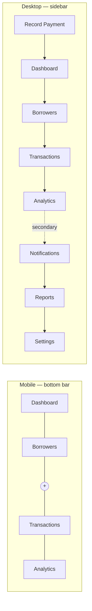
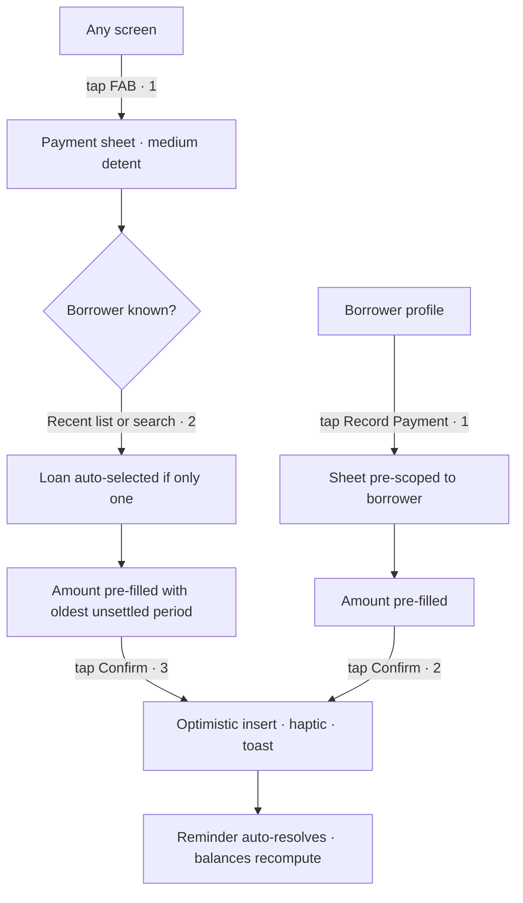
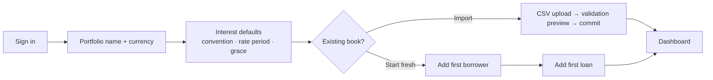
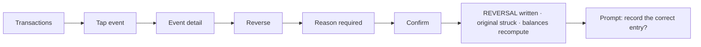
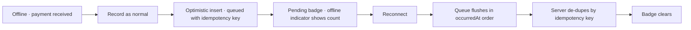

# Orbit — Information Architecture

**What Moves, Grows**

| Field | Value |
| --- | --- |
| Product | Orbit |
| Document | Phase 2 — Information Architecture |
| Version | 1.0 |
| Status | Awaiting approval |
| Depends on | [Phase 1 — Product Requirements](./01-product-requirements.md) |
| Amends | UX-01 (navigation composition) — see §21 |

---

## 1. Purpose

This document fixes **where everything lives, how it is reached, and what each surface is for** — before a single pixel or endpoint is designed. It is the contract that Phases 5 (folder structure), 6 (API design), and 9 (UI screens) are built against.

Phase 1 established two constraints that pull against each other:

- Fifteen dashboard signals, six modules, ten analytics surfaces, and a full ledger.
- "Calm. Minimal. Every screen answers one question. The user should never feel overwhelmed."

Resolving that tension is the central work of this phase. The answer is not fewer features. It is **tiered disclosure with adaptive density**: signals that need attention advance, signals that are quiet recede. A portfolio in good health should render as a nearly empty screen.

---

## 2. IA Principles

| # | Principle | Consequence |
| --- | --- | --- |
| 1 | **One question per screen** | Any screen answering two questions is split, or the second answer moves to a detail surface |
| 2 | **Empty signals recede, active signals advance** | Zero-value cards collapse into a quiet summary line; they never occupy prime space to say "nothing" |
| 3 | **Entities get flat canonical URLs** | Hierarchy is expressed in the interface, never in URL depth |
| 4 | **Overlays are addressable** | Every sheet and modal has a URL, so any state is linkable, refreshable, and back-button correct |
| 5 | **Navigation is for destinations; the FAB is for actions** | Nav never contains verbs; the FAB never contains a place |
| 6 | **Depth over breadth is a failure** | Nothing sits more than two levels below a nav root |
| 7 | **State is in the URL** | Filters, ranges, and tabs are query params, so views are shareable and restorable |
| 8 | **The record path is the shortest path** | Recording a payment is the highest-frequency action and gets the most privileged position in the entire interface |

---

## 3. Navigation Model

### 3.1 Structural decision

Phase 1 (UX-01) specified a five-item bottom bar containing Settings. Building the route map exposed two problems:

1. **Settings occupies a permanent slot for a rare action.** Frequency ranking is Dashboard (daily) → Borrowers (daily) → Transactions (weekly) → Analytics (monthly) → Settings (a few times per year). A permanent thumb-reachable slot for the least-used destination is a wasted slot.
2. **Notifications had no home.** Phase 1 listed it as a top-level module but the five-item bar was already full. Notifications is a *state* surface — checked reactively when badged — not a place browsed by choice.

**Resolution — four destinations plus a centred action:**

```
┌──────────────────────────────────────────────────┐
│  Orbit              [portfolio ▾]      🔔    ◍   │   top bar
├──────────────────────────────────────────────────┤
│                                                  │
│                    content                       │
│                                                  │
├──────────────────────────────────────────────────┤
│   ◇         ○        ( + )       ⇅        ◔      │   bottom bar
│ Dashboard Borrowers  action  Transactions Analytics
└──────────────────────────────────────────────────┘
```

- **Bottom bar:** Dashboard, Borrowers, **FAB**, Transactions, Analytics.
- **Top bar:** notification bell with unread badge (right), account/settings avatar (far right), portfolio selector (centre, inert in V1 — present so multi-portfolio is additive).
- The FAB takes the centre position: thumb-optimal, and it carries the product's highest-frequency action.

This satisfies every Phase 1 requirement — Settings and Notifications remain one tap from every screen and keep full canonical routes — while lowering permanent chrome from five items to four. Formal amendment in §21.

### 3.2 Desktop

At `≥1024px` the bottom bar becomes a collapsible left sidebar carrying the same four destinations plus Notifications, Reports, and Settings as a secondary group. The FAB becomes a primary "Record Payment" button pinned to the sidebar head, with `⌘K` as the power path.



### 3.3 FAB context-awareness

The FAB's primary action changes by route; a long-press or up-swipe reveals the full action set.

| Route | Primary action | Secondary actions |
| --- | --- | --- |
| `/dashboard` | Record Payment | Add Loan, Add Borrower, New Reminder |
| `/borrowers` | Add Borrower | Record Payment, New Reminder |
| `/borrowers/[id]` | Record Payment *(pre-scoped)* | Add Loan, New Reminder, Upload Document |
| `/loans/[id]` | Record Payment *(pre-scoped)* | Extend, Amend Terms, Close Loan |
| `/transactions` | Record Payment | Add Loan, Bulk Entry |
| `/analytics` | — *(hidden)* | Export |
| `/notifications` | New Reminder | — |
| `/settings/**` | — *(hidden)* | — |

Pre-scoping is what makes the two-tap payment path possible (§9.1).

### 3.4 Reachability proof

Maximum taps from any screen to any destination, satisfying UX-05 (≤ 3):

| To → | Dashboard | Borrower profile | Loan | Transactions | Analytics | Notifications | Settings | Record payment |
| --- | --- | --- | --- | --- | --- | --- | --- | --- |
| **From any screen** | 1 | 2 | 3 | 1 | 1 | 1 | 2 | 3 |
| **Via `⌘K`** | 2 | 2 | 2 | 2 | 2 | 2 | 2 | 2 |

Borrower profile: nav tap → card tap. Loan: nav tap → borrower card → loan band. Settings: avatar → section.

---

## 4. Route Map & URL Scheme

### 4.1 Scheme rules

| Rule | Detail |
| --- | --- |
| **Flat canonical entities** | `/loans/[loanId]`, not `/borrowers/[id]/loans/[loanId]`. A loan's URL survives re-parenting and stays short. Borrower context renders in the loan header instead. |
| **Overlays are intercepting routes** | Next.js parallel + intercepting routes render sheets over the current screen while owning a real URL. Direct navigation or refresh renders the same content as a full page. |
| **View state is query params** | `?range=6M`, `?status=overdue`, `?sort=-outstanding`, `?q=raj`. Restorable, shareable, back-button correct. |
| **Identifiers are opaque** | Slugless UUID/ULID. Borrower names are PII and never appear in URLs. |
| **No trailing-slash variants** | Canonical, lowercase, hyphenated. |

### 4.2 Full route map

```
/                                    → redirect → /dashboard
/dashboard                             Portfolio state
/dashboard/health                      Health factor breakdown (sheet)

/borrowers                             Borrower directory  ?q= ?status= ?tag= ?sort=
/borrowers/new                         Create borrower (sheet)
/borrowers/[borrowerId]                Borrower profile
/borrowers/[borrowerId]/edit           Edit borrower (sheet)
/borrowers/[borrowerId]/risk           Risk factor breakdown (sheet)
/borrowers/[borrowerId]/documents      Document grid
/borrowers/[borrowerId]/notes          Full note history

/loans/new                             Create loan (sheet)  ?borrowerId=
/loans/[loanId]                        Loan detail
/loans/[loanId]/schedule               Accrual period ledger
/loans/[loanId]/amend                  Amend terms (sheet)
/loans/[loanId]/extend                 Extend loan (sheet)
/loans/[loanId]/close                  Close loan (sheet)

/transactions                          Portfolio ledger  ?type= ?borrowerId= ?from= ?to= ?q=
/transactions/new                      Record payment (sheet)  ?borrowerId= ?loanId=
/transactions/bulk                     Month-end bulk entry
/transactions/[eventId]                Event detail (sheet)
/transactions/[eventId]/reverse        Reverse event (sheet)

/analytics                             Performance  ?range=
/analytics/[chartId]                   Single-chart focus view

/notifications                         Notification centre  ?filter=
/reminders/new                         Create reminder (sheet)
/reminders/[reminderId]                Reminder detail (sheet)

/reports                               Report library
/reports/portfolio                     Monthly portfolio report
/reports/borrower                      Borrower statement  ?borrowerId=
/reports/cash-flow                     Cash-flow report

/settings                              Settings index
/settings/profile                      Profile & portfolio
/settings/appearance                   Theme, density, motion
/settings/financial                    Interest conventions, currency
/settings/notifications                Push, quiet hours, per-type
/settings/security                     App lock, sessions
/settings/data                         Backup, export, import
/settings/about                        Version, engine version, legal

/auth/sign-in                          Email/OTP
/auth/verify                           OTP entry
/onboarding                            First-run guided setup
/locked                                Biometric lock screen
```

### 4.3 Route groups

| Group | Routes | Characteristics |
| --- | --- | --- |
| `(app)` | dashboard, borrowers, loans, transactions, analytics, notifications, reports, settings | Authenticated, chrome-wrapped, offline-capable |
| `(auth)` | sign-in, verify | Unauthenticated, no chrome, no offline |
| `(fullscreen)` | onboarding, locked | Authenticated, no chrome, no nav |
| `@modal` | all sheet routes | Intercepting, overlaid, dismissible |

---

## 5. Screen Inventory

Every screen declares the one question it answers. If a screen cannot state its question in a single sentence, it does not ship.

### 5.1 Core surfaces

| # | Screen | Question it answers | Primary entity | Primary action |
| --- | --- | --- | --- | --- |
| 1 | Dashboard | *Is my capital healthy today?* | Portfolio | Record Payment |
| 2 | Borrower directory | *Who owes me what, and who needs attention?* | Borrower | Add Borrower |
| 3 | Borrower profile | *What is my complete history with this person?* | Borrower | Record Payment |
| 4 | Loan detail | *What is the state of this specific deployment of capital?* | Loan | Record Payment |
| 5 | Transactions | *What has moved?* | LedgerEvent | Record Payment |
| 6 | Analytics | *How is my capital performing over time?* | AnalyticsSnapshot | Change range |
| 7 | Notifications | *What needs me?* | Notification | Resolve |
| 8 | Settings | *How does Orbit behave?* | Settings | — |

### 5.2 Detail surfaces

| # | Screen | Question | Reached from |
| --- | --- | --- | --- |
| 9 | Accrual schedule | *How was this interest derived, period by period?* | Loan detail |
| 10 | Health breakdown | *Why is my portfolio scored this way?* | Dashboard health ring |
| 11 | Risk breakdown | *Why is this borrower scored this way?* | Borrower profile |
| 12 | Documents | *What paperwork do I hold?* | Borrower profile |
| 13 | Notes | *What have I recorded about this relationship?* | Borrower profile |
| 14 | Event detail | *Exactly what happened here, and when was it recorded?* | Transactions |
| 15 | Chart focus | *What does this single trend show in detail?* | Analytics |
| 16 | Report library | *What can I produce for my records?* | Settings / Analytics |

### 5.3 Flow surfaces (sheets)

| # | Sheet | Question | Steps |
| --- | --- | --- | --- |
| 17 | Record payment | *What came in, from whom, against what?* | 1–2 |
| 18 | Create borrower | *Who is this person?* | 1 |
| 19 | Create loan | *What are the terms of this deployment?* | 2 |
| 20 | Close loan | *Is this finished, and is anything unrecovered?* | 1–2 |
| 21 | Amend terms | *What changed, and from when?* | 1 |
| 22 | Extend loan | *What is the new expected end date?* | 1 |
| 23 | Reverse event | *What was wrong, and why?* | 1 |
| 24 | Create reminder | *What should I be prompted about, and when?* | 1 |
| 25 | Bulk entry | *Who paid this month?* | 1 |
| 26 | Upload document | *What is this file, and what does it belong to?* | 1 |

### 5.4 System surfaces

| # | Screen | Question |
| --- | --- | --- |
| 27 | Sign in | *Who are you?* |
| 28 | Onboarding | *What is your book?* |
| 29 | Lock screen | *Is it still you?* |
| 30 | Command palette | *What are you looking for?* |

**Total: 30 surfaces.** Sixteen are sheets or breakdowns layered over the eight core screens, which is what keeps the perceived surface area small.

---

## 6. Screen Anatomy

### 6.1 Dashboard — tiered disclosure

The fifteen Phase 1 signals are ranked and gated. Tiers 1–2 are what a healthy portfolio shows; everything else is below the fold, reached by deliberate scroll.

| Tier | Content | Visibility rule |
| --- | --- | --- |
| **1 — Glance** | Portfolio Value (hero, count-up) · Health ring · as-of timestamp | Always |
| **2 — Attention** | Today's Tasks · Collections Due (due vs overdue split) | **Hidden entirely when empty** |
| **3 — Position** | Outstanding Principal · Interest Earned · Interest Due This Month · Overdue | 2-col grid; zero-value cards collapse to a single quiet line |
| **4 — Character** | Avg Interest Rate · Avg Loan Size · Collection Rate (sparkline) | Always, compact |
| **5 — Forward** | Cash Flow Forecast (6mo) · Upcoming Collections (30d, grouped by date) | Forecast always; collections hidden when empty |
| **6 — Behind** | Recent Activity (last 10 events) | Hidden until first event exists |

**The adaptive rule:** a portfolio with nothing overdue and no tasks today renders Tier 1, skips Tier 2 entirely, and shows a calm grid. A portfolio with three overdue loans surfaces them immediately beneath the hero. The screen's density is a function of how much actually needs the user — this is how fifteen metrics stay calm.

Quick Actions (D-15) are absorbed by the FAB action set rather than occupying a card, removing a redundant surface.

### 6.2 Borrower directory

| Zone | Content |
| --- | --- |
| Header | Search field (always visible, focus via `/`) · filter chip row · sort control |
| Segment | All · Needs Attention · Active · Closed — *Needs Attention* is default when non-empty |
| List | Virtualised borrower cards |
| Card | Avatar/monogram · name · status pill · **outstanding (dominant)** · rate · next due date · risk dot |
| Swipe → | Call · WhatsApp |
| Swipe ← | Mark Paid · Remind |
| Footer | Aggregate line: "24 borrowers · ₹1,84,50,000 outstanding" |

### 6.3 Borrower profile

| Zone | Content |
| --- | --- |
| Hero | Photo · name · relationship tag · **total outstanding** · risk badge (tappable → breakdown) |
| Actions | Record Payment · Call · WhatsApp · Remind · overflow (New Loan, Upload, Edit, Archive) |
| Summary | 6 compact cards: principal out · interest earned · interest outstanding · loans active/total · avg rate · relationship since |
| Loan timeline | Horizontal bands per loan — tenure, status, repayment progress. Tap → loan detail |
| Tabs | Activity (default) · Documents · Notes · Analytics |
| Activity | Unified ledger across all their loans, grouped by day |
| Analytics tab | Punctuality history · interest contribution to portfolio · exposure share (with warning if over threshold) |

### 6.4 Loan detail

| Zone | Content |
| --- | --- |
| Header | Borrower name (back-affordance) · loan reference · status pill |
| Hero | Outstanding principal · accrued interest · **interest outstanding (dominant)** |
| Terms | Principal · rate + period · convention · day count · start · expected end · grace |
| Next | Next due date · next due amount · days remaining or overdue |
| Schedule | Accrual periods — settled, due, overdue, upcoming. Tap → derivation (E-12) |
| History | Event list, newest first; reversals struck through and linked to their reversal |
| Actions | Record Payment · Extend · Amend Terms · Close |

### 6.5 Transactions

| Zone | Content |
| --- | --- |
| Header | Search · filter chips (type, borrower, date range, direction) · export |
| Summary | Filtered totals: in / out / net — recalculates with filters |
| Timeline | Day-grouped, sticky date headers, infinite scroll |
| Row | Type glyph · borrower avatar + name · loan ref · **signed amount** · relative time |
| Row state | Reversed rows struck through; adjustments carry a reason glyph |
| Tap | → Event detail sheet |

### 6.6 Analytics

| Zone | Content |
| --- | --- |
| Header | Range selector (3M · 6M · 1Y · All), persisted to URL and settings |
| Section: Performance | Monthly Interest · Portfolio Growth · Collection Rate |
| Section: Position | Outstanding Capital · Interest Distribution · Top Borrowers |
| Section: Recovery | Late Payments · Recovery Trends |
| Section: Forward | Cash Flow · Forecast |
| Each chart | Title · single-sentence plain-language read · chart · "View detail" |

The plain-language read is required. A chart that needs interpretation has not finished its job — "Collections improved to 94% from 87% six months ago" sits above the line chart, not inside a tooltip.

---

## 7. Entity → Surface Matrix

| Entity | Created at | Listed at | Detailed at | Edited at | Appears within |
| --- | --- | --- | --- | --- | --- |
| Borrower | `/borrowers/new` | `/borrowers` | `/borrowers/[id]` | `/borrowers/[id]/edit` | Dashboard, Transactions, Analytics, Notifications |
| Loan | `/loans/new` | Borrower profile | `/loans/[id]` | `/loans/[id]/amend` | Dashboard, Transactions, Reports |
| LedgerEvent | `/transactions/new` | `/transactions` | `/transactions/[id]` | **Never** *(reverse only)* | Borrower profile, Loan detail, Dashboard |
| AccrualPeriod | *(engine)* | `/loans/[id]/schedule` | Derivation sheet | **Never** | Dashboard, Analytics, Reminders |
| Reminder | `/reminders/new` | `/notifications` | `/reminders/[id]` | Reminder detail | Dashboard tasks, Borrower profile |
| Document | Upload sheet | `/borrowers/[id]/documents` | Preview overlay | Metadata only | Loan detail, Borrower profile |
| Notification | *(system)* | `/notifications` | — | **Never** | Top-bar bell |
| AnalyticsSnapshot | *(system)* | — | — | **Never** | Analytics, Dashboard |
| Settings | *(implicit)* | `/settings` | Section pages | Section pages | — |

Entities that are never editable in the interface are the ledger's integrity guarantee made visible.

---

## 8. Overlay Inventory

| Type | Mobile | Desktop | Dismiss | URL |
| --- | --- | --- | --- | --- |
| **Sheet** — forms, flows | Bottom sheet, drag-to-dismiss | Centred modal, 480–640px | Swipe / Esc / backdrop | Yes |
| **Breakdown** — derivations | Bottom sheet, medium detent | Popover anchored to trigger | Tap-out / Esc | Yes |
| **Preview** — documents | Full-screen | Lightbox | Swipe down / Esc | No |
| **Command palette** | Full-screen search | Centred, 640px | Esc | No |
| **Confirm** — destructive | Centred alert | Centred alert | Explicit choice only | No |
| **Toast** — outcomes | Top, auto-dismiss 4s | Bottom-right | Auto / swipe | No |
| **Menu** — overflow | Action sheet | Dropdown | Tap-out / Esc | No |

Sheets have detents: `medium` (~55%) for single-field actions, `large` (~92%) for multi-field forms. Recording a payment opens at `medium` — the amount and confirm button are reachable without the sheet ever covering the screen.

**Confirmation is required only for:** loan closure with unrecovered principal, event reversal, borrower archival, data import, and account deletion. Everything else is undoable and therefore must not interrupt.

---

## 9. Critical Flows

### 9.1 Record a received payment — the primary flow

The single most important interaction in the product. Two entry paths.



| Path | Taps | Requirement |
| --- | --- | --- |
| From any screen via FAB | **3** | T-05 satisfied |
| From borrower profile | **2** | Better than target |
| From a dashboard task | **2** | Task carries full context |
| From a swipe action | **1** | Mark Paid commits the suggested amount |

Sheet defaults, all overridable: oldest unsettled accrual period · `INTEREST_RECEIVED` · full due amount · today's date. A split across interest and principal (T-07) is one expandable control, not a second step.

### 9.2 First run



Onboarding sets conventions **once**, so every later loan form is pre-filled and loan creation stays a two-step sheet.

### 9.3 Month-end reconciliation

The 10-minute-for-40-borrowers target (Phase 1 success criteria).

1. Dashboard → Collections Due → filtered list of unsettled periods.
2. Bulk entry mode: one row per borrower, amount pre-filled with the due figure.
3. Tick those who paid, adjust any partials inline, commit once.
4. Remaining rows become overdue on grace expiry and generate reminders automatically.

### 9.4 Correcting a mistake



Nothing is deleted. The original event, the reversal, and the replacement all remain visible and linked — this is the audit trail the user is paying for.

### 9.5 Offline capture



Because the ledger is append-only, no merge conflict is possible — only ordering and de-duplication (PWA-04).

### 9.6 Closing a loan

Blocked path when outstanding is non-zero: the sheet states the exact remaining figure and requires an explicit choice — *record final payment* or *write off with reason*. There is no third door. On success, a restrained animation and a permanent timeline entry.

---

## 10. Search & Command Architecture

### 10.1 Two distinct systems

| System | Trigger | Scope | Purpose |
| --- | --- | --- | --- |
| **Local search** | `/` or tapping the field | Current list only | Filter what is on screen |
| **Command palette** | `⌘K` / `Ctrl+K` | Everything | Navigate and act |

Conflating these is a common failure. Local search never navigates away; the palette always does.

### 10.2 Palette result groups

Ordered by likely intent, capped at 5 per group:

1. **Borrowers** — fuzzy on name, phone, tag → borrower profile
2. **Actions** — Record Payment, Add Borrower, Add Loan, New Reminder, Export
3. **Navigation** — the eight core screens plus settings sections
4. **Loans** — by borrower name and amount
5. **Recent** — last five visited entities, shown when the query is empty

Typing a bare number searches amounts across borrowers and events. Empty state shows Recent plus the top three actions.

---

## 11. Filter & Sort Model

One filter architecture, shared by every list, serialised to the URL.

| Surface | Filters | Sorts | Default |
| --- | --- | --- | --- |
| Borrowers | status, tag, rate band, amount band | outstanding, next due, risk, name, tenure | Needs Attention, then next due ↑ |
| Transactions | type, borrower, loan, date range, amount range, direction | date, amount | date ↓ |
| Notifications | type, read state, borrower | date | date ↓ |
| Loan schedule | period status | period date | date ↓ |

Rules: filters render as removable chips with a persistent "Clear all"; active filters always show a result count; filter state survives back-navigation (UX-08); sort is single-key with direction toggle — no multi-key sorting in V1.

---

## 12. Notification & Reminder IA

### 12.1 Model separation

**Reminder** = a dated intention (an entity the user owns). **Notification** = a delivery of that intention (a system record). One reminder may produce several notifications — push at generation, in-app on open, escalation on overdue.

### 12.2 Types and routing

| Type | Generated | Deep-links to | Auto-resolves |
| --- | --- | --- | --- |
| Interest due | Per active loan, per accrual period | Payment sheet, pre-scoped | On matching receipt |
| Overdue | On grace expiry | Payment sheet, pre-scoped | On matching receipt |
| Loan closure due | Configurable lead before expected end | Loan detail | On closure or extension |
| Concentration warning | Exposure crosses threshold | Borrower profile | On exposure falling |
| Custom | By user | Linked entity, or none | Manually |
| System | Sync failure, backup status | Relevant settings page | On resolution |

Every notification deep-links to the surface where it can be *acted on*, never to a generic list. An interest-due notification opens the payment sheet with borrower, loan, amount, and period already selected — one tap from notification to recorded payment.

### 12.3 Notification centre

Grouped Today / This Week / Earlier. Unread carry a left accent rail. Actions inline where possible (Record, Snooze, Dismiss) so the centre resolves work rather than merely listing it.

---

## 13. State Matrix

Every data surface implements all five states (Phase 1 §9.3).

| Surface | Loading | Empty | Error | Offline |
| --- | --- | --- | --- | --- |
| Dashboard | Skeleton matching card geometry | First-run guidance + Add Borrower | Per-card boundary; healthy cards still render | Last-known state + as-of banner |
| Borrowers | 6 skeleton cards | Illustration + Add Borrower | Full-list retry | Cached list + banner |
| Borrower profile | Hero + summary skeletons | *(unreachable)* | Retry, nav intact | Cached + pending-write badges |
| Loan detail | Skeleton | *(unreachable)* | Retry | Cached |
| Transactions | 10 skeleton rows | "No transactions yet" + Record | Retry preserving filters | Cached page + queued items shown pending |
| Analytics | Chart-shaped skeletons | "Not enough history yet" + what's needed | Per-chart boundary | Last snapshot + as-of |
| Notifications | 5 skeleton rows | "You're all caught up" | Retry | Cached |
| Search | Inline shimmer | "No matches for X" + clear | Inline message | Local-only, labelled |

**Rules:** skeletons match final geometry exactly (UX-12, CLS < 0.05). One failing widget never blanks a screen (REL-04). Every offline surface states its last-synced time. Empty states always carry the action that resolves them.

---

## 14. Empty State Copy

Tone: calm, factual, never cute. Never blames the user.

| Surface | Headline | Support | Action |
| --- | --- | --- | --- |
| Dashboard (first run) | Your portfolio starts here | Add your first borrower and Orbit will track everything that follows. | Add Borrower |
| Borrowers | No borrowers yet | Every loan begins with a person. | Add Borrower |
| Transactions | Nothing has moved yet | Payments, disbursements, and adjustments will appear here. | Record Payment |
| Analytics | Not enough history yet | Charts appear once you have two months of activity. | — |
| Notifications | You're all caught up | Reminders appear here as interest falls due. | — |
| Documents | No documents | Agreements, cheques, and IDs can live here. | Upload |
| Search | No matches for "raj" | Try a name, phone number, or amount. | Clear |
| Overdue filter | Nothing overdue | Every collection is current. | — |

---

## 15. Content & Labelling Standards

### 15.1 Terminology — canonical, enforced in code review

| Use | Never use |
| --- | --- |
| Borrower | Debtor, client, customer, party, account holder |
| Loan | Account, facility, credit line |
| Outstanding | Balance due, remaining |
| Received | Collected *(as a verb on a recorded payment)* |
| Due | Payable, owing |
| Overdue | Late, delinquent, defaulted, in default |
| Written off | Bad debt, loss, charge-off |
| Accrued | Pending interest, earned-not-paid |
| Needs attention | Problem accounts, at-risk accounts |
| Strained *(risk band)* | High risk, poor, bad |

### 15.2 Tone rules

1. **Never punitive.** Borrowers are relationships. "Ravi — 6 days overdue" is fine. "Ravi is delinquent" is not.
2. **State facts, not judgements.** "Collection rate 87%" — never "Poor collection rate."
3. **Label every projection.** Forecast figures always carry "projected" or "expected".
4. **Date every figure.** No monetary value renders without an as-of context.
5. **Numbers over adjectives.** "3 loans overdue · ₹4,20,000" beats "Several overdue loans."

### 15.3 Number formatting

| Context | Format |
| --- | --- |
| Hero values | `₹1,84,50,000` — Indian grouping, no decimals |
| List values | `₹1,84,500` — no decimals |
| Precise/ledger | `₹1,84,500.00` — two decimals |
| Compact charts | `₹1.8Cr`, `₹4.2L`, `₹12K` |
| Rates | `2% / month` — period always explicit |
| Signed | `+₹25,000` accent · `−₹5,00,000` secondary |
| Dates | `12 Mar` · `12 Mar 2026` cross-year · `Today`/`Yesterday` within 2 days |
| Overdue | `6 days overdue` — never a bare negative number |

---

## 16. Keyboard Map

| Key | Action |
| --- | --- |
| `⌘K` | Command palette |
| `/` | Focus local search |
| `G` then `D` / `B` / `T` / `A` / `N` / `S` | Go to Dashboard / Borrowers / Transactions / Analytics / Notifications / Settings |
| `N` | New — context-aware (mirrors the FAB) |
| `P` | Record payment |
| `Esc` | Close overlay, clear search |
| `⌘Enter` | Submit active form |
| `J` / `K` | Next / previous list item |
| `Enter` | Open focused item |
| `1`–`4` | Analytics range: 3M / 6M / 1Y / All |
| `?` | Shortcut cheatsheet |
| `⌘\` | Toggle sidebar (desktop) |

Sequential `G`-prefixed navigation follows the Linear convention. All shortcuts are disabled while a text input holds focus, except `Esc` and `⌘Enter`.

---

## 17. Responsive Behaviour

| Breakpoint | Width | Navigation | Grid | Overlays |
| --- | --- | --- | --- | --- |
| `sm` | < 640 | Bottom bar + FAB | 1 col, 2-col metrics | Bottom sheets |
| `md` | 640–1023 | Bottom bar + FAB | 2 col | Bottom sheets |
| `lg` | 1024–1439 | Sidebar (collapsible) | 3 col | Centred modals |
| `xl` | ≥ 1440 | Sidebar (expanded) | 4 col, max-width 1440 | Centred modals |

Layout shifts that are **not** mere reflow:

- **Borrower profile** at `lg+`: tabs become a two-column split — timeline left, documents/notes right.
- **Transactions** at `lg+`: list left, selected event detail in a persistent right pane instead of a sheet.
- **Analytics** at `lg+`: two charts per row; the plain-language read moves inline beside the title.
- **Loan detail** at `lg+`: terms and schedule side by side.

Content never exceeds 1440px. Swipe actions are touch-only; hover row-actions are their pointer equivalent (B-07).

---

## 18. Progressive Disclosure Rules

| Rule | Application |
| --- | --- |
| **Derivations are one tap deep, never inline** | Health score, risk score, and accrual arithmetic each open a breakdown; the number alone sits on the surface |
| **Advanced form fields collapse by default** | Loan creation shows principal, rate, start date; convention, day count, and grace hide behind "Advanced" pre-filled from settings |
| **History truncates at 10 with "View all"** | Dashboard activity, borrower notes, loan events |
| **Zero-value cards collapse** | Dashboard Tier 3 |
| **Filters collapse to a count chip when applied** | All lists |
| **Terms show current, amendments on demand** | Loan detail shows live terms; "3 amendments" reveals history |

---

## 19. Deep Linking & Shareability

Every surface is addressable and refresh-safe (UX-09). Because URLs carry no PII, they are safe to bookmark and paste into personal notes.

| Link | Behaviour |
| --- | --- |
| `/borrowers/[id]` | Profile |
| `/loans/[id]?period=2026-03` | Loan with a schedule period focused |
| `/transactions?borrowerId=x&type=INTEREST_RECEIVED` | Pre-filtered ledger |
| `/transactions/new?loanId=x&amount=10000` | Payment sheet pre-filled — the notification target |
| `/analytics?range=1Y&chart=collection-rate` | Analytics scrolled and focused |
| `/dashboard/health` | Dashboard with breakdown open |

Direct navigation to a sheet URL renders it as a full page with correct back behaviour; navigation from within the app renders it as an overlay. Same route, two presentations.

---

## 20. Open Questions

| # | Question | Needed by | Default |
| --- | --- | --- | --- |
| Q7 | Should the borrower directory default to *Needs Attention* even when empty, or fall back to *All*? | Phase 9 | Fall back to All when Needs Attention is empty |
| Q8 | Does bulk entry belong in V1, or is it a month-end refinement? | Phase 9 | Keep in V1 — it carries the 10-minute reconciliation target |
| Q9 | Should the loan detail be a route or a sheet over the borrower profile? | Phase 5 | Route — it is too dense for a sheet and needs to be linkable |
| Q10 | Do documents need a portfolio-wide library, or is per-borrower sufficient? | Phase 3 | Per-borrower for V1; the schema permits a global view later |

**Carried from Phase 1, still unanswered — proceeding on defaults, and these bind the Phase 3 schema:** Q1 penalty is a manual one-off event, not an accrual · Q2 multiple disbursement tranches supported · Q3 partial interest carries forward within the period · Q4 recovery is recorded against the closed loan without reopening it · Q5 grace window defaults to 5 days · Q6 cost-of-capital tracking is out of V1 scope.

---

## 21. Amendments to Phase 1

| Ref | Change | Rationale |
| --- | --- | --- |
| **UX-01** | Bottom navigation is **four destinations plus a centred FAB** (Dashboard, Borrowers, **+**, Transactions, Analytics). Settings moves to the top-bar avatar; Notifications to the top-bar bell. | Settings is the lowest-frequency destination and does not warrant a permanent thumb-reachable slot; Notifications had no home in a full five-item bar. Both remain one tap from every screen with full canonical routes. Reduces permanent chrome while improving access to the highest-frequency action. |
| **D-15** | Quick Actions are delivered by the FAB action set rather than a dashboard card. | Removes a redundant surface and keeps the same actions available from every screen, not just the dashboard. |

No other Phase 1 requirement is altered. All MUST items remain in scope.

---

*End of Phase 2.*
