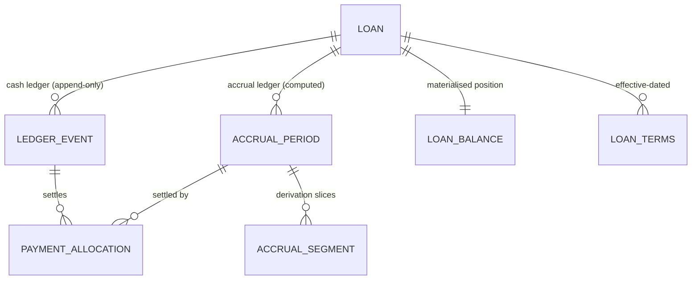

# Orbit — Database Schema

**What Moves, Grows**

| Field | Value |
| --- | --- |
| Product | Orbit |
| Document | Phase 3 — Database Schema |
| Version | 1.0 |
| Status | Awaiting approval |
| Depends on | [Phase 1 — PRD](./01-product-requirements.md) · [Phase 2 — IA](./02-information-architecture.md) |
| Artifacts | `prisma/schema.prisma` · `prisma/sql/*.sql` · `prisma.config.ts` |
| Verified | Applied to PostgreSQL 16.13; 27/27 invariant checks pass |

---

## 1. What this phase delivers

Not a diagram — a schema that has been applied to a real PostgreSQL 16 instance, with its integrity guarantees proved by an executable test.

| Artifact | Purpose |
| --- | --- |
| `prisma/schema.prisma` | 18 models, 15 enums, all relations and Prisma-expressible indexes |
| `prisma/sql/001_immutability.sql` | Append-only enforcement, posting rules, settlement sync |
| `prisma/sql/002_rls.sql` | Row-level security, the application role, cross-tenant integrity |
| `prisma/sql/003_indexes.sql` | Partial, trigram, and expression indexes Prisma cannot express |
| `prisma/sql/004_auth_bridge.sql` | Supabase Auth bridge, account bootstrap, right-to-erasure |
| `prisma/sql/tests/ledger_invariants.sql` | 27 executable assertions over the guarantees above |
| `prisma.config.ts` | Prisma 7 datasource configuration |
| `.env.example` | Environment template with the RLS-critical connection warning |

**Verification performed:**

```
✓ base schema applied            18 tables · 15 enums · 84 indexes · 61 constraints
✓ 001_immutability applied       11 triggers
✓ 002_rls applied                RLS on 18 tables · 21 policies
✓ 003_indexes applied
✓ 004_auth_bridge applied
✓ all four re-applied cleanly    (idempotent)
✓ 27/27 invariant checks pass    0 failures
```

---

## 2. The dual ledger, physically

Phase 1 committed to separating what *should* have been earned from what *actually* moved. Four tables carry that:



| Table | Role | Mutability |
| --- | --- | --- |
| `ledger_event` | Cash ledger — the source of financial truth | **Append-only** |
| `accrual_period` | Accrual ledger — one billing cycle | Regenerable by the engine |
| `accrual_segment` | Computation slices within a cycle | Regenerable |
| `payment_allocation` | Which receipt settled which cycle | **Append-only, signed** |
| `loan_balance` | Materialised position for list queries | Derived cache |

`interest_outstanding = Σ accrual_period.accrued − Σ payment_allocation.amount`. Both sides are independently recomputable, which is what makes "overdue" distinguishable from "not yet due".

---

## 3. Decisions

### 3.1 Money is `BIGINT` minor units

Every monetary column is `BIGINT` holding paise. Verified: no minor-unit column resolves to any other type.

`INTEGER` would have been a latent disaster — ₹10 crore is 10¹⁰ paise, five times `int4`'s ceiling. A portfolio would work in testing and overflow in production at exactly the scale the product targets.

`NUMERIC` was rejected too: it invites `Decimal` in application code, and Prisma's `Decimal` round-trips through a JS library whose semantics differ from Postgres's. `BigInt` maps to JS `bigint` with exact integer arithmetic on both sides.

### 3.2 The posting model

Each event carries a headline `amount_minor` (always ≥ 0, the figure the interface shows) plus four signed deltas stating its effect on balances. Sign convention: positive increases what is owed to the lender; positive `cash_delta` means money arriving.

| Event | principal | interest | penalty | cash |
| --- | --- | --- | --- | --- |
| `LOAN_DISBURSED` | +A | 0 | 0 | −A |
| `INTEREST_RECEIVED` | 0 | −A | 0 | +A |
| `PRINCIPAL_RECEIVED` | −A | 0 | 0 | +A |
| `PENALTY_CHARGED` | 0 | 0 | +A | 0 |
| `PENALTY_WAIVED` | 0 | 0 | −A | 0 |
| `LOAN_WRITTEN_OFF` | ≤0 | ≤0 | 0 | 0 |
| `ADJUSTMENT` | any | any | any | any |
| `REVERSAL` | exact negation of the target | | | |
| non-financial | 0 | 0 | 0 | 0 |

Every row of that table is a `CHECK` constraint. Recomputing any balance is then `SUM()` over the event log — proved by invariant check 6.

### 3.3 Split receipts are two events, not one

A ₹15,000 receipt split ₹10,000 interest / ₹5,000 principal is **two rows sharing a `group_id`**, presented as one entry in the interface.

I initially modelled this as a single row using both delta columns. That breaks `tax_category`: interest is taxable income, principal movement is not, and one row cannot carry both classifications. Since Phase 1 §12 requires tax categorisation from day one specifically to avoid a future backfill, single-row splits would have created the exact migration that accommodation exists to prevent.

### 3.4 Effective-dated terms

`loan_terms` is versioned with an `effective_from` date rather than mutating the loan. Current terms are the greatest `effective_from <= today`. This is what makes E-09 true by construction: amending a rate cannot retroactively change historical accruals, because the historical periods were computed against a different terms row that still exists.

### 3.5 Accrual periods split into segments

A cycle is what the user sees and settles. Segments are how it was computed. When principal is repaid mid-cycle on a reducing-balance loan, the cycle splits into segments with different bases — the worked example in PRD §7.3.

Settlement attaches to the **cycle**, derivation reads the **segments**. This is what E-12 ("expose the full derivation") reads from, and it keeps allocation logic simple: one payment settles one cycle, regardless of how many segments the engine used.

`accrued_micro_minor` on segments stores the unrounded figure scaled by 10⁶, so precision carries across segments without a float ever appearing (M-04), with the residue landing in the cycle's `carry_out_minor` (M-05).

### 3.6 Reversal by negative allocation

When a receipt is reversed, its allocations are not deleted — a **negative allocation** is appended. `settled_minor` is a trigger-maintained sum, so it falls automatically and the cycle's status returns to `PARTIAL`.

This is what keeps immutability coherent end to end. A design that deleted allocations would have an append-only event table sitting on top of a mutable settlement table, and the audit trail would be a half-truth. Invariant check 5 proves the unwind happens with no row mutated.

### 3.7 Denormalised `user_id` everywhere

Every tenant-scoped table carries `user_id` and (where applicable) `portfolio_id`, even where they are reachable by join. This makes every RLS policy a single indexed predicate rather than a correlated subquery — the difference between an index scan and a nested loop on every row of every query.

---

## 4. Integrity guarantees

These live in the database. Application code can be wrong; a trigger cannot be bypassed by a console session, a bad migration, or a future contributor who has not read the PRD.

| Guarantee | Mechanism | Proved by |
| --- | --- | --- |
| Ledger events are never updated or deleted | `BEFORE UPDATE/DELETE/TRUNCATE` triggers **and** no `UPDATE`/`DELETE` grant to `orbit_app` | checks 2, 9 |
| Postings match their event type | 7 `CHECK` constraints | check 1 |
| Reversals negate exactly | `enforce_reversal_symmetry` trigger | check 4 |
| An event is reversed at most once | `UNIQUE (reverses_event_id)` | check 4 |
| A reversal cannot be reversed | trigger | check 4 |
| Discretionary events state a reason | `CHECK` on `ADJUSTMENT`, `REVERSAL`, `PENALTY_WAIVED`, `LOAN_WRITTEN_OFF` | check 1 |
| Retries never double-post | `UNIQUE (user_id, idempotency_key)` | check 3 |
| Settlement cannot drift from allocations | `AFTER INSERT` trigger recomputes `settled_minor` | check 5 |
| A cycle cannot be over-settled | `CHECK` with a one-unit rounding tolerance | check 5 |
| Borrowers with history cannot be deleted | trigger, counts events first | check 7 |
| Tenants cannot read each other's rows | RLS policies on all 18 tables | check 8 |
| A row cannot claim one tenant while referencing another's | composite FKs on `(id, user_id)` | check 10 |

Two mechanisms guard the ledger deliberately. The trigger stops the owner role; the missing grant stops `orbit_app`. Either alone leaves a path open.

---

## 5. Row-level security

### 5.1 The problem the application role solves

**RLS does not apply to a table's owner.** A default Supabase connection string authenticates as `postgres`, which owns every table. An application connecting that way has every policy silently inert — RLS present in the schema, absent in effect.

The fix is a dedicated `orbit_app` role that owns nothing and holds no `BYPASSRLS`. Migrations run as the owner; the application runs as `orbit_app`. `.env.example` carries this warning at the connection string itself, because that is where the mistake gets made.

### 5.2 Why not `FORCE ROW LEVEL SECURITY`

`FORCE` subjects the owner to RLS as well, which sounds strictly safer. Applying it revealed the opposite: every policy is scoped `TO orbit_app, authenticated`, so the owner would match **no** policy and be denied outright — breaking migrations, engine jobs, and the `SECURITY DEFINER` functions that bootstrap accounts and honour deletion requests.

Owner bypass is the correct posture. The guarantee comes from the application never holding owner credentials, not from `FORCE`.

### 5.3 Two callers, one predicate

```sql
using (user_id = (select orbit.current_user_id()))
```

`orbit.current_user_id()` resolves identity from `app.user_id` (Prisma) or falls back to `auth.uid()` (Supabase/PostgREST), degrading safely where the `auth` schema does not exist — which is what lets the same policies run on a local test database.

**The Prisma path must use `SET LOCAL` inside the transaction that runs the query.** A session-level `SET` would leak identity between requests sharing a pgBouncer connection. This is a hard requirement on the repository layer in Phase 10.

The `(select …)` wrapper makes the planner evaluate the function once per statement as an InitPlan rather than once per row.

---

## 6. Indexing

41 indexes come from the schema; `003_indexes.sql` adds the rest, each tied to a named query.

| Query | Index | Requirement |
| --- | --- | --- |
| Borrower search on name/phone | GIN trigram | B-02 |
| Transaction note search | GIN trigram | T-04 |
| "Needs attention" segment | partial on `(portfolio_id, status)` | Phase 2 §6.2 |
| Collections Due | partial on unsettled cycles | D-05, D-06 |
| Upcoming Collections | partial on `UPCOMING` | D-12 |
| Today's Tasks / badge | partial on pending reminders, unread notifications | D-11, R-10 |
| Transaction timeline paging | `(portfolio_id, occurred_at desc, seq desc)` excluding reversed | T-10, P-07 |
| Balance replay | `(loan_id, seq)` | REL-05 |
| Monthly roll-ups | `(portfolio_id, occurred_at, type)` | A-15 |

**One index had to change design.** The natural choice for monthly roll-ups is an expression index on `date_trunc('month', occurred_at)`. Postgres rejects it: `date_trunc` over `timestamptz` is `STABLE`, not `IMMUTABLE`, because its result depends on the session `TimeZone`. Pinning it to UTC would make it indexable but would bucket months in the wrong timezone for the user.

It is therefore a plain composite index, and roll-up queries must express the month as a half-open range computed in the user's timezone by the caller. That is a range scan the index serves directly, and it is more correct than the expression index would have been. Binding on Phase 11.

---

## 7. Open questions, now bound

Q1–Q6 carried unanswered from Phase 1 and shaped this schema. They are now decided:

| # | Question | Decision | Where it lives |
| --- | --- | --- | --- |
| Q1 | Does penalty interest accrue? | **No** — a manual one-off event | `PENALTY_CHARGED` / `PENALTY_WAIVED` post to `penalty_delta_minor`; no accrual rows generated |
| Q2 | Multiple disbursement tranches? | **Yes** | `loan.original_principal_minor` is a cache; the ledger permits many `LOAN_DISBURSED` events |
| Q3 | Partial interest — carry forward or arrears bucket? | **Carry forward within the cycle** | `accrual_period.settled_minor < accrued_minor` with status `PARTIAL`; no second table |
| Q4 | Does recovery reopen a written-off loan? | **No** | `enforce_loan_open_for_posting` permits receipts against closed loans but blocks disbursement, penalty, and extension |
| Q5 | Default grace window? | **5 days**, configurable | `portfolio.default_grace_days`, copied to `loan_terms.grace_days` |
| Q6 | Track cost of capital? | **Out of V1 scope** | Not modelled |

New questions from this phase:

| # | Question | Needed by | Default |
| --- | --- | --- | --- |
| Q11 | Should `loan.reference` be user-editable or always system-generated? | Phase 6 | System-generated (`L-001`), editable later |
| Q12 | Retain `engine_run` rows indefinitely, or prune after N days? | Phase 12 | Prune after 90 days |
| Q13 | Should `accrual_period` regeneration be blocked outright once a cycle has allocations? | Phase 11 | Blocked — the FK is `RESTRICT`, so regeneration must upsert, never delete |

---

## 8. What is deliberately absent

| Absent | Reason |
| --- | --- |
| A `payments` table | Payments are `ledger_event` rows. A separate table would create a second financial truth. |
| `deleted_at` on financial tables | Soft delete is a mutation. Reversal is the mechanism. |
| Stored `outstanding_balance` on `loan` | It lives on `loan_balance` as an explicitly labelled cache with a `last_event_seq` watermark, so staleness is detectable rather than invisible. |
| Currency conversion tables | V1 is single-currency per portfolio. Amounts carry their code so multi-currency is additive. |
| A generic `audit_log` | The ledger *is* the audit log for financial events. Non-financial changes are low-value to audit for a single user; revisit for teams. |
| Materialised views for analytics | `portfolio_snapshot` is an ordinary table the engine writes. Materialised views cannot be refreshed per-tenant without full recomputation. |

---

## 9. Applying the schema

Order matters. The SQL files depend on tables that migrations create.

```bash
# 1. Generate and apply the base schema (owner role, unpooled connection)
pnpm prisma migrate dev --name <description>

# 2. Apply integrity, security, and index layers — in order, every time
for f in prisma/sql/0*.sql; do
  psql "$DIRECT_URL" -v ON_ERROR_STOP=1 -f "$f"
done

# 3. Verify the guarantees still hold
psql "$DIRECT_URL" -v ON_ERROR_STOP=1 -f prisma/sql/tests/ledger_invariants.sql
```

All four files are idempotent and verified safe to re-run. Step 3 belongs in CI (ENG-07) — the invariants are the ledger's contract, and a migration that breaks one must fail the build.

**Against a live database**, `003_indexes.sql` should be re-run with `CREATE INDEX CONCURRENTLY` and outside a transaction. The committed file omits `CONCURRENTLY` so it can run inside a migration transaction; a `--concurrent` variant is a Phase 14 deployment concern.

---

## 10. Amendments to earlier phases

| Ref | Change | Rationale |
| --- | --- | --- |
| PRD T-07 | A split receipt is **two ledger events sharing a `group_id`**, not one event with mixed deltas. The interface still presents one entry, so no UX requirement changes. | A single row cannot carry two `taxCategory` values, and Phase 1 §12 requires tax classification at write time to avoid a future backfill. |
| PRD §6.4 | The event field list gains `groupId`, and `reversedByEventId` is derived from the back-reference rather than stored. | Storing both directions would require updating the reversed row, violating append-only. |

No other requirement is altered.

---

*End of Phase 3.*
