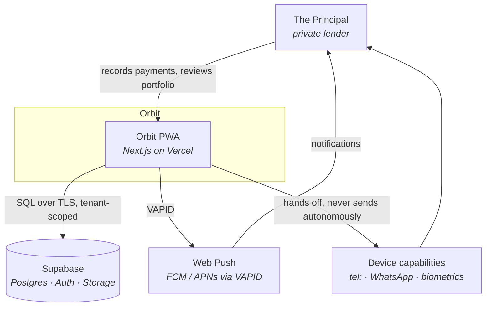
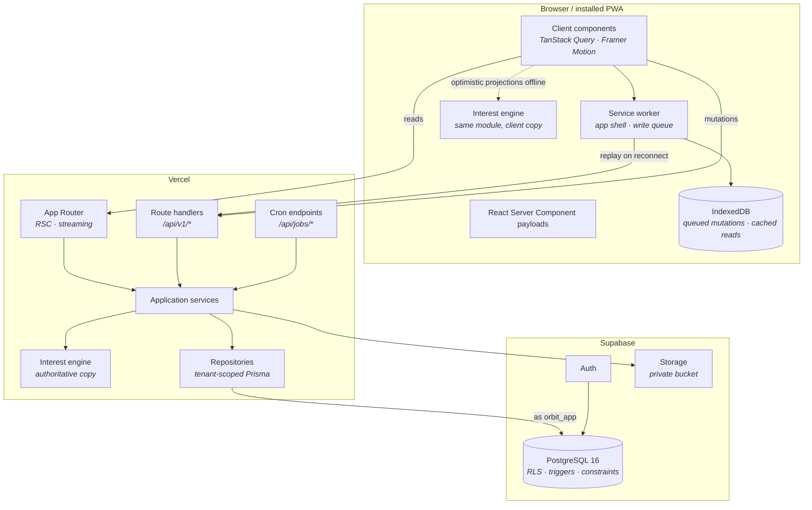
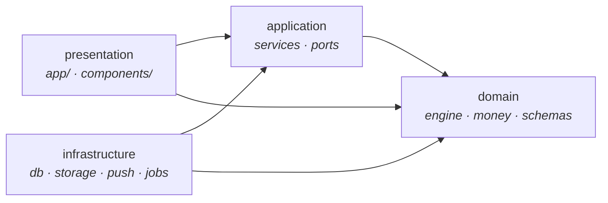
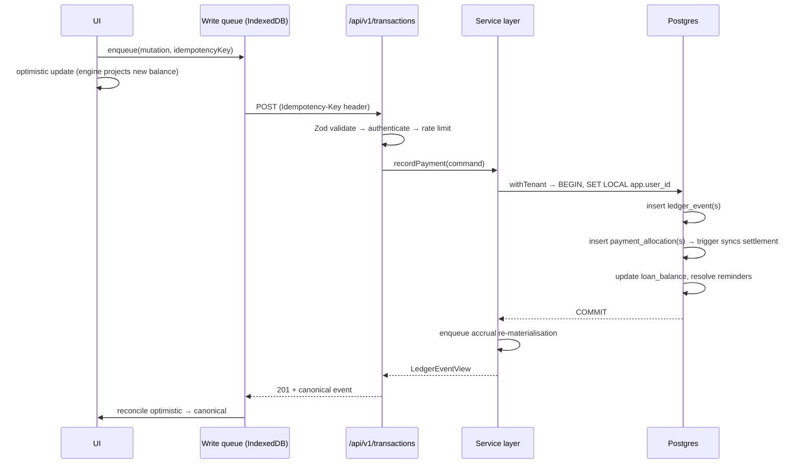

# Orbit — System Architecture

**What Moves, Grows**

| Field | Value |
| --- | --- |
| Product | Orbit |
| Document | Phase 4 — System Architecture |
| Version | 1.0 |
| Status | Awaiting approval |
| Depends on | [Phase 1 — PRD](./01-product-requirements.md) · [Phase 2 — IA](./02-information-architecture.md) · [Phase 3 — Schema](./03-database-schema.md) |

---

## 1. Purpose

Phase 3 proved the data layer's guarantees against a live database. This phase decides how the running system upholds them — where code lives, what may depend on what, how a request becomes a tenant-scoped query, how a payment recorded on a train reaches the ledger, and what happens when each piece fails.

Three constraints inherited from earlier phases drive nearly every decision here:

| Inherited constraint | Architectural consequence |
| --- | --- |
| RLS requires `app.user_id` set **inside the query's transaction** (Phase 3 §5.3) | Tenancy becomes an explicit, enforced boundary in code — §7 |
| Payments must be recordable offline and replayed later (PRD PWA-03) | Mutations cannot use Server Actions; they need replayable HTTP — §9 |
| The interest engine must be pure, deterministic, and run identically on server and client (PRD E-02, E-13) | The engine is a dependency-free module that never touches I/O — §6 |

---

## 2. Architectural Principles

| # | Principle | Consequence |
| --- | --- | --- |
| 1 | **Dependencies point inward** | Domain knows nothing of Prisma, React, or HTTP. Enforced by tooling, not convention. |
| 2 | **The ledger is the truth; everything else is a projection** | Any cache, balance, or snapshot can be dropped and rebuilt from events. |
| 3 | **Tenancy is a type, not a habit** | It is impossible to obtain a database handle without naming a tenant. |
| 4 | **Purity where correctness matters** | Financial computation has no I/O, no clock access, no randomness. |
| 5 | **The network is optional** | Offline is a supported state, not an error state. |
| 6 | **Every derived number is traceable** | Engine version and inputs are recorded alongside results. |
| 7 | **Fail small** | One broken widget degrades to a placeholder; it never blanks a screen. |
| 8 | **Boring where it is not the product** | Managed platform services everywhere except the engine, which is bespoke because it *is* the product. |

---

## 3. System Context



Orbit integrates with nothing that holds borrower data. WhatsApp and telephony are **hand-offs** — Orbit composes a draft and passes control to the OS. No message leaves the device without an explicit human action (PRD anti-goals, B-08).

---

## 4. Container View



| Container | Responsibility | Why |
| --- | --- | --- |
| App Router | Read paths, streaming, RSC | Server-rendered reads keep the client bundle inside the 180KB budget (P-05) |
| Route handlers | All mutations | Replayable by the service worker; Server Actions are not (§9) |
| Cron endpoints | Accrual, reminders, snapshots, risk | Vercel Cron, secret-authenticated (§12) |
| Application services | Use cases, transaction boundaries | The only layer permitted to compose repositories and the engine |
| Interest engine | Financial computation | Pure, shipped to both runtimes (§6) |
| Repositories | Tenant-scoped data access | The sole holder of a database handle (§7) |
| Service worker | Shell cache, write queue | Makes offline a supported state (§10) |

---

## 5. Module Architecture

### 5.1 Layers and the dependency rule



**Dependencies point inward, always.** `domain` imports nothing from the other three. `application` defines *ports* (interfaces); `infrastructure` provides *adapters*. Presentation never reaches past `application` to touch a repository.

| Layer | Contains | May import |
| --- | --- | --- |
| `domain` | Interest engine, risk model, health model, money primitives, Zod schemas, domain errors | Nothing outside `domain` |
| `application` | Use-case services, port interfaces, cache-tag taxonomy | `domain` |
| `infrastructure` | Prisma repositories, tenant client, storage, push, job runners | `domain`, `application` |
| `presentation` | Routes, RSC loaders, components, hooks | `domain`, `application` |

Enforced in CI by `dependency-cruiser`, not by review. A violation fails the build (PRD ENG-02, ENG-07).

### 5.2 Why ports and adapters here

This is not architecture for its own sake — it is what makes PRD §12 additive. `RiskModel` and `InterestStrategy` are ports today with one implementation each. Adding compound interest, or an AI risk model, means adding an adapter, not editing a service. Bank integration becomes a second `LedgerEventSource` adapter alongside `MANUAL`.

---

## 6. The Interest Engine

The engine is the product's core intellectual property and the one component built to a materially higher standard than everything around it.

### 6.1 Isolation contract

```ts
// domain/engine/interest/types.ts

/** Everything the engine needs. No database, no clock, no I/O. */
export interface AccrualInput {
  readonly loanId: LoanId
  readonly currency: CurrencyCode
  /** Effective-dated terms, ascending. Never mutated retroactively (E-09). */
  readonly termsTimeline: readonly EffectiveTerms[]
  /** Principal-affecting events, ascending by occurredAt. */
  readonly principalEvents: readonly PrincipalEvent[]
  readonly startDate: PlainDate
  readonly closedOn: PlainDate | null
  /** Explicit — never Date.now(). This is what makes runs reproducible (E-02). */
  readonly asOf: PlainDate
  readonly anchorToStartDay: boolean
}

export interface AccrualResult {
  readonly periods: readonly ComputedPeriod[]
  readonly engineVersion: EngineVersion
  /** Sub-minor-unit remainder carried beyond the final period (M-05). */
  readonly residualMicroMinor: bigint
}

export function computeAccrual(input: AccrualInput): AccrualResult
```

| Rule | Enforcement |
| --- | --- |
| No I/O, no network, no filesystem | `domain` has zero runtime dependencies in `package.json` |
| No ambient time | `Date.now()` and `new Date()` banned in `domain` by lint rule; `asOf` is an input |
| No floating point on money | `bigint` only; ESLint bans `Number` arithmetic on `*Minor` identifiers |
| Deterministic | Property test: same input, 1000 runs, identical output |
| Versioned | `engineVersion` stamped on every period (E-14) |
| ≥ 95% branch coverage | CI gate (ENG-04) |

### 6.2 Engine vs materialiser

A distinction that matters:

| Component | Layer | Responsibility |
| --- | --- | --- |
| `computeAccrual` | `domain` | Terms + events + `asOf` → periods. Pure. |
| `AccrualMaterialiser` | `application` | Load inputs, call engine, diff against stored periods, upsert |

The materialiser upserts on `(loanId, cycleIndex)` and **never deletes** a period carrying allocations — the foreign key is `RESTRICT`, so an attempt fails loudly rather than silently orphaning settlement (Phase 3 Q13).

### 6.3 Running the same engine on the client

Because the engine is pure and dependency-free, the client imports it directly. Two consequences:

1. **Offline projection.** A payment recorded without a network updates displayed balances immediately using the same arithmetic the server will apply.
2. **No drift.** There is one implementation. A client-side approximation that disagreed with the server would be worse than showing nothing.

The engine is tree-shakeable and lazily imported only where projections are needed, keeping it out of the initial bundle.

---

## 7. Data Access & Tenancy

**The most safety-critical mechanism in the system.**

### 7.1 The problem

Phase 3 established two facts:

- RLS policies resolve identity via `orbit.current_user_id()`, which reads `app.user_id`.
- With pgBouncer transaction pooling, a connection is shared between requests, so a session-level `SET` would leak one user's identity into another user's query.

Therefore **`SET LOCAL` must run inside the same transaction as every query**, and there must be no way to run a query outside that discipline.

### 7.2 The mechanism

```ts
// infrastructure/db/tenant.ts

/** Branded so a tenant-scoped handle cannot be forged or passed around loosely. */
export type TenantDb = Prisma.TransactionClient & { readonly __tenant: unique symbol }

/**
 * The only way to obtain a database handle. Opens a transaction, pins the
 * tenant for its duration, and runs the callback inside it.
 */
export async function withTenant<T>(
  userId: UserId,
  fn: (db: TenantDb) => Promise<T>,
  opts?: { readonly readOnly?: boolean },
): Promise<T> {
  return prisma.$transaction(async (tx) => {
    // Third argument `true` makes this LOCAL — scoped to this transaction only.
    await tx.$executeRaw`SELECT set_config('app.user_id', ${userId}::text, true)`
    if (opts?.readOnly) {
      await tx.$executeRawUnsafe('SET TRANSACTION READ ONLY')
    }
    return fn(tx as TenantDb)
  })
}
```

The base `prisma` client is **module-private**. Nothing outside `infrastructure/db` can import it; repositories accept a `TenantDb` and cannot construct one. Obtaining data without naming a tenant is a type error, not a code-review finding.

This is the mechanism Phase 3's invariant checks 8 and 9 exercised directly — `set_config('app.user_id', …, true)` followed by queries as `orbit_app`, proving both that the owning tenant sees its rows and that a different tenant sees nothing.

### 7.3 Where the boundary sits

Wrapping every individual query in its own transaction would add a `BEGIN`/`SET`/`COMMIT` round trip per query — the dashboard alone issues roughly eight.

**The tenancy boundary is the loader, not the query and not the request.**

```ts
export async function loadDashboard(userId: UserId, asOf: PlainDate) {
  return withTenant(userId, async (db) => {
    const [position, tasks, collections, activity] = await Promise.all([
      portfolioRepo.position(db, asOf),
      reminderRepo.dueToday(db, asOf),
      accrualRepo.collectionsDue(db, asOf),
      ledgerRepo.recentActivity(db, 10),
    ])
    return assembleDashboard({ position, tasks, collections, activity })
  }, { readOnly: true })
}
```

One transaction, one `SET LOCAL`, four parallel queries. Coarse enough to amortise the overhead; fine enough that a connection is never held across rendering, external calls, or anything slow.

**Rule:** a `withTenant` block contains database work only. Never an HTTP call, never a push dispatch, never file I/O.

### 7.4 Defence in depth

| Layer | Protection |
| --- | --- |
| Type system | No `TenantDb` without `withTenant` |
| Application | Repositories filter on `userId` explicitly as well |
| Database | RLS policies (Phase 3 §5) |
| Database | Composite `(id, user_id)` foreign keys make cross-tenant rows unrepresentable |
| Connection | Application authenticates as `orbit_app`, a non-owner without `BYPASSRLS` |

Any one of these failing leaves the others standing.

---

## 8. Rendering Strategy

### 8.1 Server-first, client where it earns it

| Surface | Rendering | Reason |
| --- | --- | --- |
| Dashboard | RSC, streamed per tier | Tier 1 paints immediately; heavier tiers stream in (§8.2) |
| Borrower directory | RSC shell + client list | Search and filter are instant and local (B-02) |
| Borrower profile | RSC hero + client tabs | Hero is the answer; tabs are exploration |
| Loan detail | RSC | Mostly static once loaded |
| Transactions | RSC first page + client infinite scroll | Cursor pagination on `(occurredAt, seq)` (Phase 3 §6) |
| Analytics | RSC data + client charts | Recharts needs the DOM; data does not |
| Sheets and forms | Client | Interaction, validation, optimistic writes |
| Settings | RSC + client controls | Rarely visited; no reason to ship JS eagerly |

### 8.2 Streaming maps onto the dashboard tiers

Phase 2's tier model was designed for visual calm. It doubles, without modification, as a streaming boundary map:

```tsx
<DashboardShell>
  {/* Tier 1 — awaited. The hero is the answer to the screen's question. */}
  <PortfolioHero data={await position} />

  {/* Tier 2 — suspends. Absent entirely when there is nothing to attend to. */}
  <Suspense fallback={<AttentionSkeleton />}>
    <AttentionTier userId={userId} />
  </Suspense>

  {/* Tiers 3–6 — suspend independently; a slow chart never delays the grid. */}
  <Suspense fallback={<MetricGridSkeleton />}><PositionTier … /></Suspense>
  <Suspense fallback={<ForecastSkeleton />}><ForwardTier … /></Suspense>
  <Suspense fallback={<ActivitySkeleton />}><ActivityTier … /></Suspense>
</DashboardShell>
```

Each boundary carries a skeleton matching its final geometry, which is what holds CLS under 0.05 (P-03, UX-12).

### 8.3 Client state ownership

| State | Owner |
| --- | --- |
| Server data | TanStack Query, seeded by RSC |
| Pending offline mutations | IndexedDB, surfaced via a queue hook |
| Filters, sort, range | URL query params (Phase 2 §4.1) |
| Sheet open/closed | Route (intercepting routes) |
| Theme, density | `next-themes` + `localStorage`, hydrated from cookie to avoid flash |
| Ephemeral UI | Local component state |

Nothing durable lives in a global client store. There is no Redux-shaped hole in this architecture.

---

## 9. Mutation Architecture

### 9.1 Why route handlers rather than Server Actions

Server Actions are the ergonomic default in the App Router, and I am deliberately not using them for the mutation path.

A Server Action invocation is an opaque POST in the RSC protocol, keyed to a build-specific action ID. A service worker cannot construct one, and a queued action serialised before a deploy would reference an action ID that no longer exists after it. Offline replay would break on every deployment.

**All financial mutations go through versioned route handlers** (`/api/v1/*`) with plain JSON bodies — replayable, inspectable, versionable, and testable with `curl`.

Server Actions remain appropriate for non-queueable operations: settings changes, theme, profile. These fail loudly offline, which is correct — nobody needs to change their theme on a train.

### 9.2 The mutation pipeline



Every step between `BEGIN` and `COMMIT` is one transaction. A payment either lands completely — event, allocation, balance, reminder resolution — or not at all (REL-01).

### 9.3 Idempotency is a success path, not an error path

The client generates a ULID idempotency key **before** the first attempt and reuses it on every retry. The unique constraint on `(user_id, idempotency_key)` guarantees at-most-once posting.

Critically: when a replay hits an existing key, the API returns **`200` with the original event**, not `409`. A network timeout after a successful write is indistinguishable from a failure at the client, so retry is inevitable and must be uneventful. Surfacing it as an error would show a spurious failure for a payment that was in fact recorded.

| Situation | Response |
| --- | --- |
| New key | `201 Created` + event |
| Replayed key, identical payload | `200 OK` + original event |
| Replayed key, different payload | `409 Conflict` — a genuine client bug |

---

## 10. Offline & Sync

### 10.1 Why this is unusually simple here

Offline sync is normally the hardest part of a system like this, because concurrent edits conflict. Orbit's ledger is **append-only**, so there is nothing to merge — two devices appending events produce a union, never a contradiction (PWA-04).

Sync reduces to two mechanical problems: **ordering** and **de-duplication**. Both are already solved — `occurredAt` orders, and `idempotencyKey` de-duplicates.

This is a direct dividend of the Phase 1 ledger decision.

### 10.2 Queue protocol

```
enqueue   → { id, endpoint, method, body, idempotencyKey, occurredAt,
              attempts, status: PENDING, createdAt }
flush     → on 'online', on visibilitychange, on Background Sync (where supported),
            and opportunistically after any successful request
order     → ascending occurredAt, then enqueue order
retry     → exponential backoff 2s, 4s, 8s, 16s, 32s; then PARKED
outcome   → 2xx  → drop, reconcile cache
            409  → PARKED, surface for review
            4xx  → PARKED, surface (a client bug; retrying cannot help)
            5xx / network → retry
```

Background Sync is unavailable in Safari, so the `online` and `visibilitychange` listeners are the primary triggers and Background Sync is a progressive enhancement, not the mechanism.

### 10.3 What the user sees

- A discreet indicator with a pending count — never an alarming banner (Phase 2 §13).
- Optimistically applied balances, computed by the same engine the server runs.
- Queued rows shown in the timeline with a pending affordance.
- `PARKED` items surfaced as a task requiring a decision, never silently dropped.

### 10.4 Read caching

| Data | Strategy | Rationale |
| --- | --- | --- |
| App shell, static assets | Precache, cache-first | Instant repeat launch (P-04) |
| Dashboard, borrower list | Stale-while-revalidate | Useful offline; freshness is not safety-critical |
| Loan detail, ledger pages | Network-first, cache fallback | Correctness preferred; staleness labelled |
| Documents | Cache on view, LRU-capped | Signed URLs expire; re-fetch when stale |
| Mutations | Never cached | Queued instead |

Every offline surface displays its last-synced time. A stale figure presented as current would violate PRD principle 3.

---

## 11. Caching & Invalidation

### 11.1 Layers

| Layer | Holds | TTL |
| --- | --- | --- |
| TanStack Query | Client-side server state | 30s dashboard, 5m lists, ∞ closed loans |
| Next.js Data Cache | RSC-fetched reads, tagged | Until invalidated |
| `portfolio_snapshot` | Monthly analytics roll-ups | Recomputed nightly, current month hourly |
| `loan_balance` | Per-loan position | Transactional — never stale |

`loan_balance` is deliberately not a cache with a TTL. It is written in the same transaction as the event that changes it, and carries `last_event_seq` as a watermark so divergence is detectable rather than invisible.

### 11.2 Tag taxonomy

```
user:{userId}                        everything for a user
portfolio:{portfolioId}              dashboard, analytics
borrower:{borrowerId}                profile, directory row
loan:{loanId}                        detail, schedule
ledger:{portfolioId}                 transaction timeline
analytics:{portfolioId}:{yyyy-MM}    a single month's charts
reminders:{portfolioId}              tasks, notification badge
```

### 11.3 What a payment invalidates

```
INTEREST_RECEIVED on loan L (borrower B, portfolio P, March 2026)
  → loan:L · borrower:B · ledger:P · portfolio:P
  → analytics:P:2026-03
  → reminders:P            (a reminder may have auto-resolved)
```

Invalidation is computed by a single `invalidationTagsFor(event)` function in `application`, so a new event type cannot be added without deciding what it invalidates. Scattering `revalidateTag` calls through handlers is how caches go stale in ways nobody can reproduce.

---

## 12. Background Jobs

### 12.1 Schedule

| Job | Cadence | Work |
| --- | --- | --- |
| `accrual:materialise` | Daily 00:15 local + on demand after principal-affecting events | Regenerate accrual periods to `asOf` |
| `reminders:generate` | Daily 06:00 local | Interest-due, overdue, closure-due, concentration |
| `snapshot:roll-up` | Hourly for the current month; nightly for the trailing 12 | Write `portfolio_snapshot` |
| `risk:recompute` | Daily 02:00 | Borrower risk scores and factor breakdowns |
| `push:digest` | Daily, at the user's chosen hour | Digest for users who opted out of per-event push |
| `retention:prune` | Weekly | `engine_run` rows older than 90 days (Phase 3 Q12) |

### 12.2 Execution rules

| Rule | Reason |
| --- | --- |
| Authenticated by `CRON_SECRET`, constant-time compared | A cron endpoint is a public URL |
| Every run writes an `engine_run` row | A wrong recomputation must be traceable and replayable |
| Idempotent | Reminders de-duplicate on `dedupeKey`; accrual upserts on `(loanId, cycleIndex)` |
| Tenant-scoped batches | Each tenant processed in its own `withTenant` block; one failure does not abort the rest |
| Bounded runtime | Cursor over tenants; resume from the last processed id |
| Timezone-correct | Cadence resolves against the **user's** timezone, not UTC — a reminder at 06:00 UTC is 11:30 in Kolkata |

That last rule is the same trap as the `date_trunc` index in Phase 3: month and day boundaries are user-local, and treating UTC as "the" calendar silently produces wrong answers for every user outside it.

---

## 13. Errors & Failure

### 13.1 Taxonomy

```ts
// domain/errors.ts
export type DomainError =
  | { kind: 'VALIDATION';  field: string; message: string }
  | { kind: 'NOT_FOUND';   entity: string; id: string }
  | { kind: 'CONFLICT';    reason: 'IDEMPOTENT_REPLAY' | 'STATE_CHANGED' }
  | { kind: 'INVARIANT';   constraint: string; message: string }
  | { kind: 'FORBIDDEN';   reason: string }
  | { kind: 'ENGINE';      stage: string; message: string }
```

| Kind | HTTP | Client presentation |
| --- | --- | --- |
| `VALIDATION` | 422 | Inline field message |
| `NOT_FOUND` | 404 | Empty state with recovery action |
| `CONFLICT` / `IDEMPOTENT_REPLAY` | 200 | Silent — treated as success (§9.3) |
| `CONFLICT` / `STATE_CHANGED` | 409 | "This changed while you were away" + refresh |
| `INVARIANT` | 422 | Plain explanation of the rule (e.g. "a reversal cannot be reversed") |
| `FORBIDDEN` | 403 | Generic; never reveals whether the row exists |
| `ENGINE` | 500 | "We could not compute this" + last known good figure |
| Unmapped | 500 | Generic message + trace id |

Database constraint violations are translated into `INVARIANT` errors carrying the constraint name, so the guarantees written in Phase 3 surface to the user as sentences rather than SQLSTATEs.

### 13.2 Boundaries

| Level | Fallback |
| --- | --- |
| Root | Full-page error with trace id and reload |
| Route | Route-level error page; navigation stays usable |
| Tier / widget | Placeholder card; the rest of the dashboard renders (REL-04) |
| Chart | "Chart unavailable" with the accessible data table still offered |
| Mutation | Toast with retry; optimistic state rolled back visibly (REL-03) |

### 13.3 Failure modes

| Failure | Behaviour | User sees |
| --- | --- | --- |
| Database unreachable | Serve cached reads; queue writes | Offline indicator, last-synced time |
| Auth expired | Refresh; if that fails, lock screen preserving the queue | Re-authenticate; nothing lost |
| Push rejected | Mark subscription revoked, fall back to in-app | Nothing — notifications remain in-centre |
| Engine throws | Log with inputs, keep last-known-good periods | Stale-but-labelled figures |
| Cron job fails | `engine_run` records failure; next run resumes | Nothing; reminders arrive on the next cycle |
| Storage unavailable | Upload queued, document row deferred | Upload marked pending |
| Constraint violation | Transaction rolls back whole | Specific, human explanation |

---

## 14. Security Architecture

| Concern | Control |
| --- | --- |
| Authentication | Supabase Auth, email OTP; httpOnly cookies; refresh rotation |
| Session | Server-verified on every request; never trusted from client state |
| Authorisation | `withTenant` + RLS; client checks are UX affordances only (SEC-02) |
| App lock | Biometric/passcode via WebAuthn; gates the UI, not the API — the API always re-verifies |
| Documents | Private bucket; short-lived signed URLs; never public (SEC-04) |
| Validation | One Zod schema per command, shared client and server; server is authoritative (SEC-06) |
| Rate limiting | Per-user token bucket on auth and mutation routes (SEC-08) |
| Transport | HSTS, TLS only |
| Headers | Strict CSP with nonces, no inline script, `frame-ancestors 'none'` (SEC-10) |
| Logs | Structured, borrower PII redacted at the logger, never at the call site (SEC-07) |
| Secrets | Environment only; `SUPABASE_SERVICE_ROLE_KEY` never reaches a client bundle |
| Erasure | `orbit.delete_user_data` — the single audited bypass of ledger immutability (SEC-09) |

**PII discipline:** borrower names, phone numbers, and amounts never enter logs, traces, or error reports. Identifiers are logged; values are not. This is enforced by a redacting logger wrapper, because relying on every call site to remember is how leaks happen.

---

## 15. Observability

| Signal | Mechanism |
| --- | --- |
| Request traces | Trace id per request, propagated to logs and returned in error responses |
| Structured logs | JSON; `{ traceId, userId, route, durationMs, outcome }` — no PII |
| Engine runs | `engine_run` rows: kind, version, duration, stats, error |
| Web Vitals | LCP, INP, CLS reported from the client against the P-01…P-04 budget |
| Queue health | Depth and parked count reported on flush |
| Errors | Server and client capture with trace correlation |

**Three alerting conditions** worth naming now, because they indicate the ledger's guarantees are under stress rather than ordinary noise: any `INVARIANT` error reaching production, a parked-queue item older than 24 hours, and a `loan_balance.last_event_seq` lagging `max(ledger_event.seq)` for a loan.

---

## 16. Performance

| Budget | Mechanism |
| --- | --- |
| LCP < 1.8s (P-01) | RSC, streamed tiers, no blocking client fetch above the fold |
| INP < 200ms (P-02) | Optimistic mutations; heavy work off the interaction path |
| CLS < 0.05 (P-03) | Skeletons dimensionally matched to final content |
| JS < 180KB gz (P-05) | Server-first; Recharts, engine, and report generation lazily imported; `size-limit` in CI |
| Dashboard p95 < 300ms (P-06) | One transaction, parallel queries, partial indexes, snapshot roll-ups |
| 60fps at 10k events (P-07) | Virtualised lists, cursor pagination on `(occurredAt, seq)` |

The bundle budget is a **CI gate**, not a guideline. A pull request that exceeds it fails.

---

## 17. Deployment Topology

| Environment | Purpose | Database |
| --- | --- | --- |
| Local | Development | Local Postgres 16 or Supabase branch |
| Preview | Per pull request | Ephemeral Supabase branch, seeded |
| Production | Live | Supabase, PITR enabled |

Region: Vercel and Supabase co-located (`bom1` / `ap-south-1`) so the database round trip does not consume the latency budget for the primary audience.

**Migration order is fixed** and matches Phase 3 §9: `prisma migrate deploy`, then `prisma/sql/00*.sql` in order, then `ledger_invariants.sql` as a gate. A migration that breaks a ledger invariant fails the deploy rather than reaching production.

---

## 18. Open Questions

| # | Question | Needed by | Default |
| --- | --- | --- | --- |
| Q14 | Should accrual materialisation run synchronously in the payment request, or be enqueued? | Phase 10 | Enqueued — keeps the payment path inside the INP budget |
| Q15 | Vercel Cron (minute granularity, no retry) or an external scheduler with retries? | Phase 12 | Vercel Cron; jobs are idempotent, so a missed run self-heals next cycle |
| Q16 | Should the client engine copy be bundled eagerly or fetched on first offline write? | Phase 8 | Lazily imported on first mutation, warmed after idle |
| Q17 | Does V1 need real-time updates across a user's own devices? | Phase 10 | No — single user, single device typical; Supabase Realtime is additive |

---

## 19. Amendments to Earlier Phases

| Ref | Change | Rationale |
| --- | --- | --- |
| PRD ENG-02 | Clarified: feature-based organisation applies **within** `presentation` and `application`. The four architectural layers sit above features, and the dependency rule binds both. | "Feature-based" and "layered" are orthogonal; stating only the former left the domain/infrastructure boundary undefined. |
| Phase 2 §9.5 | Offline queue retries cap at five attempts, then park for user review, rather than retrying indefinitely. | Unbounded retry against a 4xx can never succeed and hides a real problem from the user. |

No other requirement is altered.

---

*End of Phase 4.*
