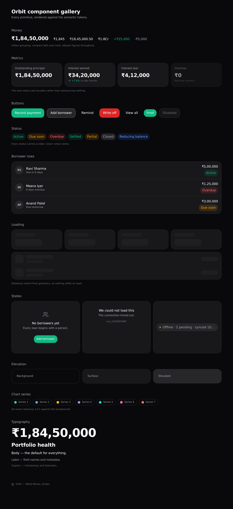

# Orbit — UI Components

**What Moves, Grows**

| Field | Value |
| --- | --- |
| Product | Orbit |
| Document | Phase 8 — UI Components |
| Version | 1.0 |
| Status | Awaiting approval |
| Depends on | [Phase 7 — Design System](./07-design-system.md) · [Phase 5 — Structure](./05-folder-structure.md) |
| Verified | Rendered in a production build and screenshotted in both themes; 50 tests; 68 modules, 0 boundary violations |

---

## 1. What this phase delivers

| Area | Components |
| --- | --- |
| `domain/money` | Exact bigint arithmetic, rounding, decimal conversion |
| `lib/format` | Locale money, rate, date, dueness, monogram |
| `components/ui` | `Button` `Card` `Badge` `StatusPill` `Skeleton` `Avatar` |
| `components/data` | `Money` `MetricCard` `HeroValue` `Delta` |
| `components/feedback` | `EmptyState` `ErrorState` `OfflineIndicator` |
| `components/layout` | `BottomNav` `Fab` |
| `app/gallery` | A rendering surface for reviewing every primitive |

**Verified:**

```
✓ pnpm typecheck      clean under strict + 4 additional flags
✓ pnpm lint           clean
✓ pnpm boundaries     no violations (68 modules, 94 dependencies)
✓ pnpm check:contrast 66/66 pairings meet WCAG 2.2 AA
✓ pnpm test           50/50 pass
✓ pnpm build          102 kB shared First Load JS — budget is 180 kB
```



---

## 2. Rendering the library found two defects nothing else caught

Typecheck, lint, boundaries, contrast, and 50 unit tests all passed on a build containing two real bugs. Both were obvious within seconds of looking at a screenshot.

### 2.1 The `size` variant was inert

`Button` carried `sm | md | lg | icon` sizes, and every one rendered at the same height. The base class applied `min-h-[44px]` for PRD ACC-05, which overrode `h-9` on the small variant.

The requirement is not wrong — it is scoped wrongly. 44pt is an Apple HIG **touch** guideline; WCAG 2.2 SC 2.5.8 asks 24px at AA, which a small button clears with a mouse. The floor now applies on coarse pointers only:

```
'[@media(pointer:coarse)]:min-h-[44px]'
```

Touch targets stay 44pt on a phone, and the size scale works on a desktop.

### 2.2 The offline chip reflowed

`OfflineIndicator` wrapped onto two lines in a narrow container, detaching the status dot from its label. A status chip that reflows reads as a problem — the opposite of what "you are offline and nothing is lost" should convey. It now stays on one line and truncates, with `shrink-0` pinning the dot.

**The lesson, recorded for later phases:** a UI phase is not verified by a green test run. Every phase from here builds a rendering surface and looks at it.

---

## 3. Money is the load-bearing component

### 3.1 A monetary value never becomes a double

`Intl.NumberFormat` accepts a **string** (ES2023, "NumberFormat V3"). So the path from database to screen is:

```
bigint (paise) → toDecimalString() → exact decimal string → Intl.format()
```

No `Number` anywhere. The difference is observable and pinned by test:

```ts
formatMoney(minor(9_007_199_254_740_993n), { style: 'precise' })
// → ₹9,00,71,99,25,47,409.93       exact
// formatting the equivalent Number yields …992
```

TypeScript does not type the string overload in any bundled lib — verified against `lib.es5.d.ts` in the pinned compiler. `src/types/intl.d.ts` adds it by declaration merging rather than casting at each call site, because a `as unknown as number` cast would type-check and silently reintroduce exactly the precision loss the money model exists to prevent.

### 3.2 `Intl` does the Indian grouping

No bespoke lakh/crore code. `en-IN` produces `₹1,84,50,000` and compact `₹1.8Cr` / `₹4.2L` natively, and the same call adapts to `en-US` → `$1.8M` when a future portfolio uses another currency.

### 3.3 Rounding is half away from zero

Not banker's rounding. A lender reconciling by hand rounds ₹0.005 up, and a ledger that disagreed with that intuition would be reported as a bug on every statement.

`applyBps` is the sanctioned multiply. The Phase 5 lint rule that flags `*` on a `*Minor` identifier exists to route callers here rather than let them write it inline and lose a paisa to truncation.

### 3.4 The `Money` component, not `formatMoney`

Every figure renders through `<Money>` rather than calling the formatter directly, which guarantees two things a scattered call cannot: `.tabular` is always applied so digits align down a column (PRD M-07), and compact values carry their precise value in a `title`.

---

## 4. Design decisions in the components

| Decision | Why |
| --- | --- |
| `MetricCard` requires `asOf` | PRD D-16 forbids an undated figure. A required prop is the only version of that rule that survives a deadline. |
| `HeroValue` animates on first paint only | Re-animating on re-render makes a portfolio value look unstable (PRD UX-11). The final frame is always the exact bigint; only intermediate frames interpolate. |
| `Delta` carries an arrow **and** a colour | Colour alone fails ACC-06 and is invisible to a significant share of users. |
| `StatusPill` takes a status, not a colour | Every status resolves to both a tone and a label, so colour is never the only channel. |
| Skeletons are shape-specific | `MetricSkeleton` and `RowSkeleton` match their content's geometry. A generic skeleton trades a spinner for a layout shift, which is worse and counts against CLS. |
| `Avatar` monogram is derived from the name | The same person always looks the same, which makes a list feel stable. |
| `Fab` sits centre in the bottom bar | It carries the highest-frequency action, and centre is the most thumb-reachable point (Phase 2 §3.1). |
| `Card` uses a border, not a shadow | On a near-black background a shadow is nearly invisible; depth comes from surface lightness (Phase 7 §5). |
| `EmptyState` always takes an action | An empty state that does not offer the thing that resolves it is a dead end. |

---

## 5. Toolchain corrections

Three problems surfaced while wiring the build. All are recorded because each was a silent failure rather than an error:

| Problem | Resolution |
| --- | --- |
| `eslint-config-next`'s legacy entry loads `@rushstack/eslint-patch`, which throws on ESLint 9 flat config | Use `@next/eslint-plugin-next`'s flat export directly |
| `.mjs` scripts sit outside the TypeScript project, so type-aware rules could not parse them | A dedicated config block with `disableTypeChecked`; `no-console` off, since stdout is a CLI's interface |
| `no-unsafe-unary-minus` flagged `-a` on a branded `Minor` | The rule is right that an arbitrary branded type is not obviously negatable. Widened to `bigint` explicitly rather than suppressed. |

---

## 6. Bundle

```
Route (app)                     Size    First Load JS
└ ○ /gallery                  14.9 kB         117 kB
+ First Load JS shared by all                 102 kB
```

102 kB shared against a 180 kB budget (PRD P-05), before Recharts, the engine, and report generation — all of which are lazily imported by design. The `size-limit` CI gate holds the ceiling.

---

## 7. Open questions

| # | Question | Needed by | Default |
| --- | --- | --- | --- |
| Q27 | Should `/gallery` ship in production or be dev-only? | Phase 14 | Dev-only via an env guard; it is 15 kB of dead weight in production |
| Q28 | Does `Delta` need an absolute-value variant, or is percentage always right? | Phase 9 | Percentage; add absolute if real screens want it |
| Q29 | Should `HeroValue`'s count-up be skipped when the value is unchanged between navigations? | Phase 9 | Yes — it already animates once per mount; verify with the router cache |
| Q30 | Is the danger fill too saturated for the product's calm register? | Phase 9 | Keep. It is only used for irreversible actions, where loudness is the point. |

---

## 8. Amendments to earlier phases

| Ref | Change | Rationale |
| --- | --- | --- |
| PRD ACC-05 | The 44pt minimum applies to **coarse pointers**. Fine pointers get WCAG 2.2 SC 2.5.8's 24px floor. | Applied unconditionally it made every size variant inert. 44pt is a touch guideline, not a mouse one. |

No other requirement is altered.

---

*End of Phase 8.*
