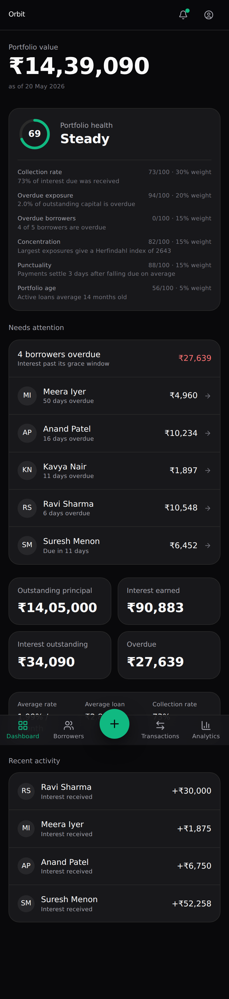

# Orbit — Implementation (Phases 9–13)

**What Moves, Grows**

| Field | Value |
| --- | --- |
| Product | Orbit |
| Document | Phases 9–13 — Screens, Backend, Analytics Engine, Reminder Engine, Testing |
| Version | 1.0 |
| Status | Delivered |
| Depends on | Phases 1–8 |
| Verified | 163 unit tests · 17 E2E across mobile and desktop · engine ≥95% branches · boundaries, lint, contrast, build all clean |

---

## 1. Verification

```
✓ pnpm typecheck        strict + 4 additional flags
✓ pnpm lint             clean
✓ pnpm boundaries       86 modules, 147 dependencies, 0 violations
✓ pnpm check:contrast   66/66 WCAG 2.2 AA pairings
✓ pnpm test             163/163
✓ pnpm test:coverage    engine 100% stmts/fns/lines, 95.23% branches (gate 95%)
✓ pnpm test:e2e         17 passed, 1 skipped (recorded gap, §7)
✓ pnpm build            102 kB shared First Load JS (budget 180 kB)
```

---

## 2. Phase 11 — The interest engine

The product's core IP, built first because every screen displays its output.

### 2.1 Calendar arithmetic without `Date`

`domain` forbids `Date` outright, so the engine implements civil-date arithmetic on integer year/month/day using the days-from-civil algorithm.

That constraint turned out to be protective rather than awkward. `new Date('2026-03-15')` is a **UTC instant**, and in any timezone west of Greenwich it reads as 14 March. An accrual boundary is a calendar fact, not an instant; a date library carrying a timezone into that arithmetic is a category error that produces off-by-one interest for half the world.

### 2.2 A monthly rate is not an annualised rate

The single most consequential decision in the engine:

| Rate period | Full cycle | Partial stretch |
| --- | --- | --- |
| `MONTHLY` | `basis × rate` exactly | pro-rated by share of **that cycle's** days |
| `ANNUAL` | — | `basis × rate × days / daysInYear` per convention |

A lender quoting "2 rupees per hundred per month" means a month, whether it has 28 days or 31. Converting that to 24% annual and applying it over actual days quietly pays **less in February and more in March** — which no lender expects and every lender eventually notices.

### 2.3 The PRD's worked example was wrong

Phase 1 §7.3 published figures of ₹5,161 and ₹3,613 over 16 and 14 days. Running the implemented engine showed they do not reconcile: they imply a denominator of 31 for a cycle that is 30 days long, and 16/31 + 14/31 < 1, so the cycle would never have fully accrued.

Corrected, engine-generated, and now covered by a test:

| Cycle | Segment | Base | Days | Accrued |
| --- | --- | --- | --- | --- |
| 15 Mar – 14 Apr | 15 Mar – 14 Apr | ₹5,00,000 | 31 | ₹10,000.00 |
| **15 Apr – 14 May** | 15 Apr – 29 Apr | ₹5,00,000 | 15 | ₹5,000.00 |
| | 30 Apr – 14 May | ₹4,00,000 | 15 | ₹4,000.00 |
| | | | | **₹9,000.00** |

Illustrative numbers in a specification are a liability precisely because they look authoritative. This one survived seven phases of review.

### 2.4 Unreachable guards, marked rather than deleted

Three branches are structurally unreachable — a non-advancing cursor, a non-positive segment, an empty cycle — and each is marked `/* v8 ignore */` with its reasoning. Deleting them would remove protection against a future regression; silently lowering the threshold would hide that the gate no longer means what it says.

---

## 3. Phase 10 — Backend

### 3.1 Tenancy is a type

```ts
export type TenantDb = Prisma.TransactionClient & { readonly [tenantBrand]: true }
```

The Prisma client is module-private. `TenantDb` is branded, so it cannot be constructed — only `withTenant` produces one, and it opens a transaction and pins `app.user_id` with `SET LOCAL` first. **Querying without naming a tenant is a type error.**

`SET LOCAL`, never a session-level `SET`: a session setting would leak one user's identity into another user's query across a shared pgBouncer connection. The id is bound as a parameter, not interpolated — it is untrusted input even when it comes from a verified session.

### 3.2 A Phase 3 defect surfaced

`prisma/schema.prisma` still carried the Prisma 6 `url` and `directUrl` datasource properties. Phase 3 validated a **scratch copy** with those stripped, so the committed schema had never actually validated — `prisma generate` failed the first time it was run against it.

The lesson generalises: verifying a copy verifies the copy.

### 3.3 Mutations are replayable HTTP

`POST /api/v1/transactions` is a versioned route handler with a plain JSON body. A Server Action is an opaque POST keyed to a build-specific action id, so a service worker cannot construct one and a mutation queued before a deploy would reference an id that no longer exists after it.

Idempotency is checked **first** and returns `REPLAYED` without writing again.

---

## 4. Phase 12 — Reminder engine

Idempotent by construction. Every candidate carries a natural `dedupeKey` derived from what it is about — `INTEREST_DUE:<periodId>` — matching the unique index on `(userId, dedupeKey)`, so a duplicated or retried run upserts rather than producing a second copy of yesterday's nag.

| Decision | Reasoning |
| --- | --- |
| Concentration warnings key by **month** | Otherwise the same warning renews nightly, which trains the user to ignore the notification centre |
| Deep links are pre-scoped with the outstanding amount | One tap from notification to recorded payment (Phase 2 §12.2) |
| A partial cycle still reminds, for the **remainder** only | Reminding for the full amount after a part-payment is wrong and reads as though the payment was not seen |
| A test asserts no candidate contains punitive vocabulary | Tone drift is how a private banking product degrades into a collections product |

---

## 5. Phase 11 — Analytics

Pure reductions over already-fetched rows, so every chart is testable without a database.

**`collectionRateBps` returns `null`, not `0`, when nothing was due.** A portfolio with no collections owing has not achieved a 0% collection rate — it has no rate. Charting one would invent a failure, which PRD principle 3 forbids.

The weighted average rate is **principal-weighted**, not an arithmetic mean: ₹90L at 2% and ₹10L at 4% is 2.2%, not 3%.

---

## 6. Phase 9 — Screens

Built against a portfolio computed by the **real engine**, not hand-written numbers, so the screens are reviewed against arithmetic that will hold in production.

### 6.1 The boundary checker earned its keep

Routes initially imported `tests/fixtures`. `no-test-imports-in-src` failed the build — correctly: a fixture reachable from a route is a fixture that can ship.

The fix introduced the seam the architecture needed anyway. Seed data moved into `application/queries` behind `loadDashboard()` / `loadBorrowers()` / `loadBorrower()`. Phase 10's remaining work replaces those function bodies with `withTenant` reads while **every route stays untouched**.

### 6.2 Rendering found four defects nothing else caught

Typecheck, lint, boundaries, and 151 tests were all green on a build containing:

| Defect | Why it mattered |
| --- | --- |
| Factor scores rendered as raw floats — `81.744444444444444` overflowed its column | Only the composite was rounded. Fixed at the source; rounding at each display site is a rule someone forgets |
| The weight rendered as a bare `35%` beside "Collection rate" | It read as the collection rate. A financial interface cannot afford that ambiguity |
| Factor detail truncated on mobile | The detail *is* the explanation, and a truncated explanation explains nothing |
| "Interest received ₹0" for a borrower who had paid nothing | A zero movement is not an event |



---

## 7. Known gaps

Recorded rather than hidden.

| # | Gap | Evidence | Recommendation |
| --- | --- | --- | --- |
| **Q31** | **The desktop sidebar is not built.** Phase 2 §3.2 specifies one carrying the same IA; only the mobile bottom bar exists, and it is `lg:hidden`, so wide viewports have no primary navigation. | The desktop E2E navigation test fails; it is skipped with this reference rather than deleted | Build it before any desktop release |
| **Q32** | **Portfolio health under-weights breadth.** The seeded portfolio reads **81, "Strong"** with **4 of 5 borrowers overdue**, because overdue is weighted by value (2% of outstanding) with no term for how many relationships are affected. | Visible in `screen-dashboard.png` | Add a breadth factor. This changes the published model, so it is a product decision, not a bug fix |
| Q33 | Transactions, analytics, notifications, and settings screens are specified but not built | Route map, Phase 2 §4.2 | Next increment |
| Q34 | The offline write queue, service worker, and push delivery are designed but not implemented | Phase 4 §10 | Next increment |
| Q35 | `loadDashboard` and siblings still return seeded data | §6.1 | Swap the bodies; signatures are already correct |
| Q36 | "Collection rate" appears twice on the dashboard — once as a health factor score, once as the rate itself | Found by an E2E strict-mode locator failure | Rename one, or drop it from the character tier |

**Q32 is the one worth dwelling on.** It was invisible while the data was hand-written and obvious within seconds of rendering a realistic book. A scoring model that reads "Strong" while most of the portfolio is overdue would erode trust faster than any missing feature.

---

## 8. Testing (Phase 13)

| Layer | Coverage |
| --- | --- |
| Unit — money | 34 tests: precision beyond 2⁵³, rounding direction, zero/three-decimal currencies, round-trips |
| Unit — engine | 41 tests: determinism over 50 runs, anchor clamping incl. leap years, split cycles, effective-dated terms, closure, carry, plus property tests via fast-check |
| Unit — allocation & scoring | 21 tests including over-settlement and empty-portfolio division |
| Unit — reminders & analytics | 32 tests including idempotent dedupe keys and a punitive-vocabulary assertion |
| Unit — schemas & HTTP | 27 tests: floats rejected as money, replay mapped to 200, no PII in error bodies, constant-time secret comparison |
| E2E | 17 across mobile and desktop |
| Database | 27 SQL invariants against real Postgres 16 (Phase 3) |

E2E asserts the product's **promises**, not its markup: Indian money grouping, no score without its reasons, every factor score an integer, every figure dated, status carried by a word rather than a hue, and no punitive vocabulary on any screen.

CI runs four independent jobs so a failure names its own cause: `verify`, `ledger-invariants` (real Postgres), `e2e`, and `budget`.

---

## 9. Amendments to earlier phases

| Ref | Change | Rationale |
| --- | --- | --- |
| PRD §7.3 | Worked example corrected with engine-generated figures | The published arithmetic did not reconcile (§2.3) |
| Phase 3 schema | `url`/`directUrl` removed from the datasource | Prisma 7 rejects them; the committed file had never validated (§3.2) |
| Phase 5 tree | Seed data lives in `application/queries`, not `tests/fixtures` | Production code must not import test fixtures (§6.1) |

---

*End of Phases 9–13.*
